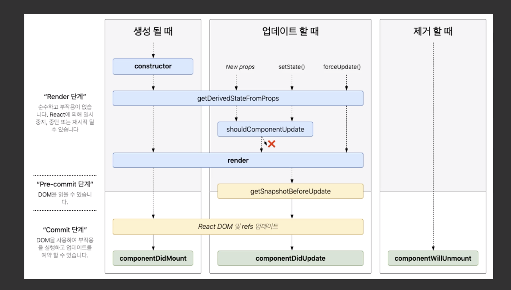

## LifeCycle 메서드
<small><i><b>LifeCycle Method 는 한국어로 "생명주기 메서드" 라고 부릅니다.</b><br>
생명주기 메서드는 컴포넌트가 브라우저상에 나타나고, 업데이트되고, 사라지게 될 때 호출되는 메서드들 입니다.<br>
추가적으로 컴포넌트에서 에러가 났을 때 호출되는 메서드도 있습니다.</i></small>

예시 코드 url : 
https://codesandbox.io/s/currying-bash-mrkjb?fontsize=14



이미지 출처 : 
http://projects.wojtekmaj.pl/react-lifecycle-methods-diagram/

```js
/* 1. 마운트 될때 발생하는 생명주기 */
constructor // 생성자 함수

getDerivedStateFromProps 
// props 로 받아온것을 state에 넣어야 할때 이 메서드를 사용
// 얘는 잘 사용안하고 componentDidMount를 사용할 수도 있음 props 를 읽어서 state 에 넣어도 됨

render // class 컴포넌트에서 render 함수 호출

// 브라우저에 Dom 랜더하고

componentDidMount 
//컴포넌트의 첫번째 렌더링이 마치고 나면 호출되는 메서드입니다. 이 메서드가 호출되는 시점에는 우리가 만든 컴포넌트가 화면에 나타난 상태입니다.
// 원하는 컴포넌트가 보여져있는 상태, Dom 접근가능 또는 외부 라이브러리를 사용할 수도 있고,

2. 업데이트 될때 (컴포넌트가 리랜더링 된다는 의미00)

getDerivedStateFromProps // props 로 받아온것을 state에 넣어야 할때 이 메서드를 사용
shouldComponentUpdate // 중요
// 컴포넌트를 최적화 해야하는 단계에서 사용. 리랜더링이 불필요할때 
// true 이면 랜더가 호출되고 false 이면 리랜더링 안하고 그냥 보여줌.
// 사용 안하면 무조건 리랜더링 하는거고 이걸 호출하고 그 안에 조건을 주면 리랜더링은 안하는 것임

    shouldComponentUpdate(nextProps, nextState) {
      console.log("shouldComponentUpdate", nextProps, nextState);
      // 숫자의 마지막 자리가 4면 리렌더링하지 않습니다
      return nextState.number % 10 !== 4;
    }

render // 랜더

getSnapshotBeforeUpdate 
// 브라우저에 반응이 일어나기 직전에 호출되는 메서드
// getSnapshotBeforeUpdate 는 컴포넌트에 변화가 일어나기 직전의 DOM 상태를 가져와서 특정 값을 반환하면 그 다음 발생하게 되는 componentDidUpdate 함수에서 받아와서 사용을 할 수 있습니다.
// 여기서 어떤 값을 리턴하면 componentDidUpdate 의 세번째 인자 snapshot 으로 받아서 업데이트 직전의 값을 조회 할 수도 있다.

componentDidUpdate
//이것에 관한 예시
//https://codesandbox.io/s/getsnapshotbeforeupdate-yeje-vpmle?fontsize=14
    componentDidUpdate(prevProps, prevState, snapshot) {
      console.log("componentDidUpdate", prevProps, prevState);
      if (snapshot) {
        console.log("업데이트 되기 직전 색상: ", snapshot);
      }
    }
// 
componentWillUnmount // componentDidMount 에서 등록한 애들을 여기서 지워줌
/*
  여기서는 주로 DOM에 직접 등록했었던 이벤트를 제거하고, 만약에 setTimeout 을 걸은것이 있다면 clearTimeout 을 통하여 제거를 합니다. 추가적으로, 외부 라이브러리를 사용한게 있고 해당 라이브러리에 dispose 기능이 있다면 여기서 호출해주시면 됩니다.
  
*/
```

자세한 설명 : 
https://react.vlpt.us/basic/25-lifecycle.html


## componentdidCatch()
## 1. 우선 예외 처리 
<i><b>if(!user) return null</b></i><br>
<small>예외처리를 해줘야 하지만, 오류를 알아내기가 힘듬 그래서 그걸 알아내기 위해서 componentdidCatch 라는것을 사용</small>

```js
// 1. return null 로 예외처리
// App.js code
function App() {
  const user = {
    id : 1,
    username : '젤라',
  }
  return (
    <div>
      <User />
      <div>asdfasdf</div> {/* 위에 User 에서 에러가 나면 얘는 출력이 안되지 */}
    </div>
  );
}

// User.js code
function User( { user }){
  if(!user) return null; 
  // 화면에 에러 출력 안하기 위해, 에러 출력되게 하면 그 아래에 있는 애들 출력안되기 때문에
  // 예외 처리를 해주는것이다.
  return (
    <div>
      <div>
        <b>Id</b> : {user.id}
      </div>
      <div>
          <b>Username</b> : {user.username}
      </div>
    </div>
  )
}
```
<small>user 값이 존재하지 않는다면 null 을 렌더링하게 됩니다. 리액트 컴포넌트에서 null 을 렌더링하게되면 아무것도 나타나지 않게 됩니다. 이를 <b>"null checking"</b> 이라고 부릅니다.

코드를 이렇게 작성해주시면, 화면에 아무것도 보여지지 않는것은 마찬가지이지만, 적어도 에러는 발생하지 않습니다. 보통 데이터를 네트워크 요청을 통하여 나중에 데이터를 받아오게 되는 상황이 발생하는 경우 이렇게 데이터가 없으면 null 을 보여주거나, 아니면 '로딩중'과 같은 결과물을 렌더링하시면 됩니다.
</small>

## componentdidCatch 메서드 사용방법
#### class형 컴포넌트에서만 사용. (getSnapshotBeforeUpdate 도..)
<small><i><b>흰 화면을 보여주는 대신에, 에러가 발생했다는 것을 알려주는 방법</b><br>
어떤 상황에 또 이런 에러가 발생하는지 알아보고, 에러를 방지 할 수 있는 방법</i></small>

```js
// App.js code
import React from 'react';
import User from './User';
import ErrorBoundary from './ErrorBoundary';

function App() {
  const user = {
    id : 1,
    username : '젤라',
  }
  return (
    <ErrorBoundary>
      <User />
    </ErrorBoundary>
  );
}

export default App;


//ErrorBoundary.js code

import React, {Component} from 'react';
class ErrorBoundary extends Component {
  state = {
    error : false
  }
  componentDidCatch(error, info){ //error 에 대한 정보, info 는 error가 어디서 발생했는지에 대한 정보
    // 아직 발견하지 못한 에러가 있을때 이렇게 사용자에게 에러가 발생했음을 알려줬을때 사용할 수 있고요.
    console.log({ // santry 라는걸로 로그를 쌓아서 에러를 관리 할 수 있음.
      error,
      info
    });
    this.setState({
      error : true
    });
  }
  render(){
    if(this.state.error) { // true 가 되면 아래 에러가 발생하는 것임.
      return <h1>에러 발생!!</h1>
    }
    return this.props.children;
  }
}
export default ErrorBoundary;
```

## Santry 라는 서비스 사용
### 실시간으로 확인가능한 서비스
url : sentry.io