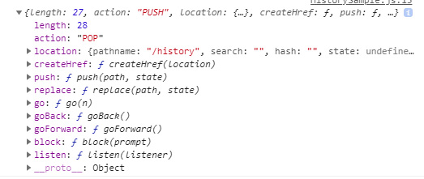

# React Router 설정
<small><i>
<b>url 값에 따른 view를 보여주는 router</b><br />
뷰 렌더링을 브라우저에서 담당
</i></small>
#### react-router-dom 설치
```js
// using ES6 modules
import { BrowserRouter, Route, Link } from "react-router-dom";

// using CommonJS modules
const BrowserRouter = require("react-router-dom").BrowserRouter;
const Route = require("react-router-dom").Route;
const Link = require("react-router-dom").Link;
```

```js
// BrowserRouter 적용시키기
// index.js code
import React from "react";
import ReactDOM from "react-dom";
import { BrowserRouter } from "react-router-dom"; // * BrowserRouter 불러오기
import App from "./App";
import "./index.css";

ReactDOM.render(
  // * App 을 BrowserRouter 로 감싸기 -> 라우터 적용끝
  <BrowserRouter>
    <App />
  </BrowserRouter>,
  document.getElementById("root")
);
```


#### 참고, HashRouter, MemoryRouter 라는게 있음.
<small><i>HashRouter 는 /# 로 되고, MemoryRouter 는 뒤에 주소가 안보임 (가상주소?로 사용)</i></small>


### {Route} from 'react-router-dom';
<small><i>Route 라는 컴포넌트 사용</i></small>

```js
// Route 는 특정 컴포넌트에 특정 주소를 보여주겠다.
// App.js code
<Route path="주소규칙" component={보여주고싶은 컴포넌트}>
```

```js
import React from "react";
import { Route } from "react-router-dom";
import Home from "./Home";
import About from "./About";

function App() {
  return (
    <div>
      <Route path="/" component={Home} exact />
      <Route path="/about" component={About} />
    </div>
  );
}

export default App;

//exact={true} 를 넣으면 완전 이 경로일때만 보여주겠다라는 뜻
```

### {Link} from 'react-router-dom';

<small><i>Link 라는 것은 누르면 다른 주소로 이동시키기<br>
<b>a 태그는 새로고침되서 사용하면 적합하지 않음,</b><br>
만약 사용한다면, onClick에 e.preventDefault() 를 호출하고 따로 자바스크립트로 주소 변환</i></small>

```js
import { Route, Link } from "react-router-dom";

<ul>
  <li>
    <Link to="/">홈</Link>
  </li>
  <li>
    <Link to="/about">소개</Link>
  </li>
</ul>

```

## 파라미터와 쿼리
<small><i>
<b>주소를 통해서 어떤 동적인 값을 읽어와야할때 사용</b><br>
</i></small>
```js
파라미터: /profiles/velopert
쿼리: /about?details=true
```
<small><i><b> 파라미터는</b> 특정 id 나 이름을 가지고 조회를 할 때 사용</i></small><br>
<small><i><b>쿼리의 경우엔</b> 어떤 키워드를 검색하거나, 요청을 할 때 필요한 옵션을 전달 할 때 사용</i></small>

#### URL Params 파라미터 사용
```js
// profile.js code
import React from "react";

const profileData = {
  angela: {
    name: "젤라님",
    description:
      "Frontend Engineer"
  },
  gildong: {
    name: "홍길동",
    description: "전래동화의 주인공"
  }
};

function Profile({ match }) { // match 는 <Router></Router> 사용하면 알아서 해줌
  const { username } = match.params;
  // console.log(username); angela임
  const profile = profileData[username];
  if (!profile) {
    return <div>존재하지 않는 사용자</div>
  }
  return (
    <div>
      <h3>
        {username} ({profile.name})
      </h3>
      <p>{profile.description}</p>
    </div>
  );
}
export default Profile;
```
#### match 설명
<small>
파라미터를 받아올 땐 match 안에 들어있는 params 값을 참조합니다.<br />
match 객체안에는 현재의 주소가 Route 컴포넌트에서 정한 규칙과 어떻게 일치하는지에 대한 정보가 들어있습니다.
path 규칙에는 /profiles/:username 이라고 넣어주면 username 에 해당하는 값을 파라미터로 넣어주어서 Profile 컴포넌트에서 match props 를 통하여 전달받을 수 있게 됩니다.
</small>

```js
//App.js code
<Route path="/profiles/:username" component={Profile} />
{/* :username 이 match.params 에 있는 username 이 되는것 */}
// http://localhost:3000/profiles/angela 입력하면 해당 값 읽어서 화면 출력
```

#### Query 쿼리 사용
```js
//About.js code
import React from "react";
import qs from 'qs';

function About({ location }) {
  console.log(location);
  // {pathname: "/about", search: "", hash: "", state: undefined} 이 찍힘
  // url에 /about?a=1 이라고 치면 search : "?a=1" 이라고 나옴

  // qs (query string) 으로 search 값을 파싱하기
  const query = qs.parse(location.search, { ignoreQueryPrefix : true});
  console.log(query);
  const detail = query.detail === "true"; // url 파람, 쿼리 파싱값은 문자열

  return (
    <div>
      <h1>소개</h1>
      <p>소개 페이지 {detail && <b> 디테일값이 트류면 나온다</b>}</p>
    </div>
  );
}
export default About;
```

# 서브라우트 설정
<small><i>
<b>서브 라우트는, 라우트 내부의 라우트를 만드는것을 의미합니다.</b><br>
컴포넌트를 만들어서 그 안에 또 Route 컴포넌트를 렌더링하면 된다.
</i></small>

<small><i><b>Tab 이 있는경우 서브라우트를 사용하면 편리함 </b></i></small>
```js
// App.js code
import Profiles from "./Profiles";
<Route path="/profiles" component={Profiles} />

//Profiles.js code
import React from "react";
import { Link, Route } from "react-router-dom";
import Profile from "./Profile";

function Profiles() {
  const render = "'Render 사용 장점은 이것'";
  return (
    <div>
      <h3>사용자 목록:</h3>
      <ul>
        <li>
          <Link to="/profiles/angela">Angela</Link>
        </li>
        <li>
          <Link to="/profiles/gildong">gildong</Link>
        </li>
      </ul>

      <Route
        path="/profiles"
        exact
        render={() => <div>유저를 선택해주세요. {render}</div>}
      />
      {/* component={} 라는것을 사용하지 않고 render 를 사용하면 바로 컴포넌트를 넣어줄 수 있음 */}
      <Route path="/profiles/:username" component={Profile} />
    </div>
  );
}
export default Profiles;
```
# 리액트 라우터 부가기능
### history 객체
<small><i>
<b>history 객체는 라우트로 사용된 컴포넌트에게 match, location 과 함께 전달되는 props 중 하나입니다.</b><br/>
이 객체를 통하여, 우리가 컴포넌트 내에 구현하는 메소드에서 라우터에 직접 접근을 할 수 있습니다 - 뒤로가기, 특정 경로로 이동, 이탈 방지 등..
</i></small>
```js
// HistorySample.js code
import React, { useEffect } from "react";

function HistorySample({ history }) {
  const goBack = () => {
    history.goBack();
  };

  const goHome = () => {
    history.push("/");
  };

  useEffect(() => {
    console.log(history);
  }, [history]);
  return (
    <div>
      <button onClick={goBack}>뒤로가기</button>
      <button onClick={goHome}>홈으로</button>
    </div>
  );
}
export default HistorySample;
```
<small><i><b>console.log(history); 객체</b></i></small>

```js
length : 방문기록의 길이가 얼마나되는지.. ?.?
action : 라우터에서 가장 마지막에 발생한
block : 사용자가 페이지 이탈할때 사용
createHref : location 값을 가지고 주소를 만드는 역할 (잘 사용 x)
go : 앞으로 go(-1) 뒤로
goBack : 뒤로가기
goForward : 앞으로가기
listen : 경로에 변동이 생겼을때 특정 함수를 호출할때 사용
location : 자신의 경로
push : 특정주소로 이동
replace : 특정주소로 이동하는데 다른점은 방문 기록을 남기지 않는다.
```

### withRouter 함수
<small><i><b>라우트 컴포넌트가 아닌곳에서 match / location / history 를 사용해야 할 때 쓰면 됩니다.</b><br/> 주로 라우터 사용 안한곳에서 조건부로 이동하려고 하는 경우 자주 사용</i></small>
```js
import React from 'react';
import { withRouter } from "react-router-dom";

function WithRouterSample({ location, match, history }){
  return (
    <div>
      <h4>location</h4>
      <textarea value={JSON.stringify(location, null, 2)} readOnly />
      <h4>match</h4>
      <textarea value={JSON.stringify(match, null, 2)} readOnly />
      <button onClick={() => history.push("/")}>홈으로</button>
    </div>
  );
}
// 함수는 내보내기 전에 사용
export default withRouter(WithRouterSample);
```
##### <b>location 같은 경우는 pathname 이 어디에서 부르던 나오는데, <br> match 같은경우는 컴포넌트 호출한곳에서 값을 받아다가 나옴</b>

### react router 의 Switch 라는 컴포넌트
<small><i><b>Switch 는 여러 Route 들을 감싸서 그 중 규칙이 일치하는 라우트 단 하나만을 렌더링시켜줍니다.</b><br/> Switch 를 사용하면, 아무것도 일치하지 않았을때 보여줄 <b>Not Found</b> 페이지를 구현 할 수도 있습니다. (이때 자주사용)</i></small>
```js
//App.js code
import { Route, Link, Switch } from "react-router-dom";
<Switch>
  <Route path="/" component={Home} exact />
  <Route path="/about" component={About} />
  {/* <Route path="/profiles/:username" component={Profile} /> */}
  <Route path="/profiles" component={Profiles} />
  <Route path="/history" component={HistorySample} />
  // path 가 없으면 무조건 렌더 하는데 switch 가 감싸고 있어서,  매칭 되는게 없으면 아래의 페이지 존재하지 않는게 랜더되서 뜨는것임.
  <Route
    render={({ location }) => (
      <div>
        <h2>이 페이지는 존재하지 않습니다.</h2>
        <p>{location.pathname}</p>
      </div>
    )}
  />
</Switch>
```

### NavLink 라는 컨포넌트
<small><i><b>현재 주소와 일치한다면 스타일 바꾸기</b><br>
NavLink 는 Link 랑 비슷한데, 만약 현재 경로와 Link 에서 사용하는 경로가 일치하는 경우 <b>특정 스타일 혹은 클래스</b>를 적용 할 수 있는 컴포넌트입니다.
</i></small>
```js
import { NavLink, Route } from "react-router-dom";

<ul>
  <li>
    <NavLink
      to="/profiles/angela"
      activeStyle={{ background: "black", color: "white" }}
      activeClassName="active"
    >
      Angela
    </NavLink>
  </li>
  <li>
    <NavLink
      to="/profiles/gildong"
      activeStyle={{ background: "black", color: "white" }}
      activeClassName="active"
      isActive={(match, location) => {
        return match.params.asdf == "asdf";
        // true 를 반환하면 들어가는거고 아니면 안들어가지고
      }}
    >
      gildong
    </NavLink>
  </li>
</ul>
```
### 기타
<small><i><b>리액트 라우터를 사용 할 때 구현하고싶은 것들을 충분히 만들 수 있을 것입니다.</b></i></small>
```js
Redirect: 페이지를 리디렉트 하는 컴포넌트
Prompt: 이전에 사용했던 history.block 의 컴포넌트 버전
Route Config: JSX 형태로 라우트를 선언하는 것이 아닌 Angular 나 Vue 처럼 배열/객체를 사용하여 라우트 정의하기
Memory Router 실제로 주소는 존재하지는 않는 라우터. 리액트 네이티브나, 임베디드 웹앱에서 사용하면 유용하다.
```

# useReactRouter Hook 사용하기
<small><i>withRouter 라는 함수를 사용해서 라우트로 사용되고 있지 않은 컴포넌트에서도 라우트 관련 props 인 match, history, location 을 조회하는 방법을 확인해보았습니다.<br />
<b>withRouter 를 사용하는 대신에 Hook 을 사용해서 구현을 할 수도 있어요.</b></i></small>

```js
// 이번 튜토리얼에서는 라이브러리를 설치해서 라우터에 관련된 값들을 Hook 으로 사용하는 방법을 알아보도록 하겠습니다.
//  라이브러리의 이름은 use-react-router 

//RouterHookSample.js code
import useReactRouter from 'use-react-router';

function RouterHookSample(){
  const { history, location, match } = useReactRouter();
  console.log({ history, location, match });
  return null;
}
export default RouterHookSample;

//Profiles.js code
import RouterHookSample from "./RouterHookSample";
<RouterHookSample />
```

<small><i><b></b></i></small>
```js
```