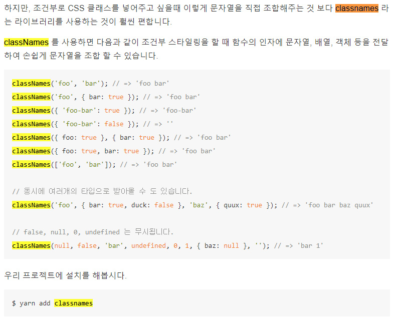

# classnames / ...rest 사용 하여 스타일링하기
<small><i><b>classnames lib 사용</b></i></small>
```js
// AppScssClassnames.js code
import React from 'react';
import Button from './components/Button';
import './App.scss';

function App() {
  return (
    <div className="App">
      <div className="buttons">
        <Button size='large' outline={true}>BUTTON</Button>
        <Button>BUTTON</Button>
        <Button size="small">BUTTON</Button>
      </div>
      <div className="buttons">
        <Button color='gray' size='large' outline>BUTTON</Button>
        <Button color='gray'>BUTTON</Button>
        <Button color='gray' size="small" 
        onClick={() => {
          console.log(111);
        }}
        onMouseMove={
          () => {
            console.log(222);
          }
        }
        >BUTTON</Button>
      </div>
    </div>
  );
}

export default App;

```
```js
import React from 'react';
import classNames from 'classnames'; //classnames lib 사용
import './Button.scss';

//size : large, medium, small 만들기
function Button({ children, size = 'medium', color = 'blue', outline, fullWidth, className, ...rest } ){
  return (
    // <button className={['Button', size].join(' ')}>{children}</button>
    <button className={classNames(
        'Button', size, color,
        {
          outline,
          fullWidth // true, false 로 받아서 true 로 출력
        },
        className
        )}
      {...rest}
    >{children}</button>
  );
}

// Button.defaultProps = {
//   size : 'medium',
//   color : 'blue'
//   outline, fullWidth 는 default 값 설정 필요없음 classNames 가 null, undefined, 0 을 출력 안하기때문
// }

export default Button;
```
#### classnames lib 조건보기
<small><i>false, null, 0, undefined 난 false 값으로 무시됨</i></small>
